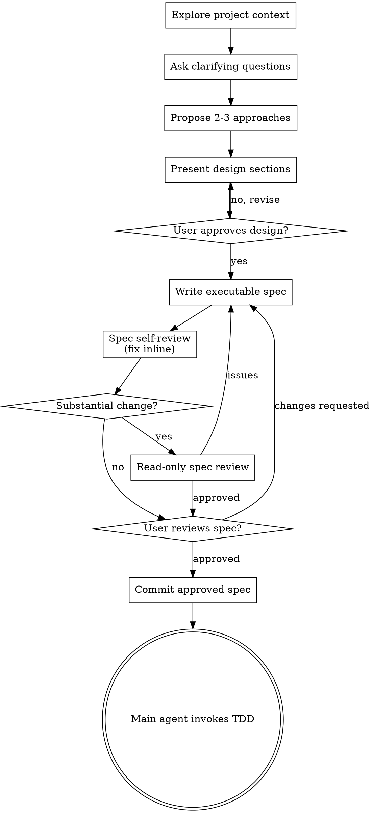

# Brainstorming Ideas Into Designs

Help turn ideas into fully formed designs and specs through natural collaborative dialogue.

Start by understanding the current project context, then ask questions one at a time to refine the idea. Once you understand what you're building, present the design and get user approval.

<HARD-GATE>
Do NOT invoke any implementation skill, write any code, scaffold any project, or take any implementation action until you have presented a design and the user has approved it. This applies to EVERY project regardless of perceived simplicity.
</HARD-GATE>

<LANGUAGE-HARD-GATE>
Before drafting any executable spec, lock one primary narrative language using
this precedence: direct user request, authoritative project language rule,
established language of an existing spec, then Chinese by default.
If the user is discussing the request in Chinese and no higher-priority rule explicitly
requires another language, the selected language is Chinese.

Write the entire spec in that selected language: title, headings, prose,
acceptance criteria, test mapping, and every Implementation Slice. Do not infer
English from this skill, repository code, filenames, fixture text, or other
technical material. Keep only required technical literals such as identifiers,
API fields, commands, paths, and exact error text in their original form. Before
review, scan every narrative heading and paragraph; translate any passage that
uses a different language without being a required technical literal.

The labeled Implementation Slice fields below define required meanings, not
fixed English output strings. Localize `Outcome`, `Depends on`, `System scope`,
`Data decisions`, `Files`, `Acceptance criteria`, `Verification`, and `Review
gate` into the selected language. English labels in a Chinese spec are
narrative-language drift, not technical literals.
</LANGUAGE-HARD-GATE>

## Anti-Pattern: "This Is Too Simple To Need A Design"

Every project goes through this process. A todo list, a single-function utility, a config change — all of them. "Simple" projects are where unexamined assumptions cause the most wasted work. The design can be short (a few sentences for truly simple projects), but you MUST present it and get approval.

## Checklist

Complete these items in order:

1. **Explore project context** — check files, docs, recent commits
2. **Offer the visual companion just-in-time** — NOT upfront. The first time a question would genuinely be clearer shown than described, offer it then (its own message); on approval its browser tab opens for you. If no visual question ever arises, never offer it. See the Visual Companion section below.
3. **Ask clarifying questions** — one at a time, understand purpose/constraints/success criteria
4. **Propose 2-3 approaches** — with trade-offs and your recommendation
5. **Present design** — in sections scaled to their complexity, get user approval after each section
6. **Lock and verify spec language** — apply the language hard gate before drafting, then scan the finished spec for narrative-language drift
7. **Write executable spec** — use the selected language and save to `docs/superpowers/specs/YYYY-MM-DD-<topic>-spec.md`
8. **Spec self-review** — quick inline check for placeholders, contradictions, ambiguity, scope (see below)
9. **Independent spec review** — for substantial changes, dispatch a read-only reviewer subagent using the bundled prompt
10. **User reviews written spec** — ask user to review the spec file before proceeding
11. **Commit approved spec** — commit only the finalized spec and record that commit as the implementation baseline
12. **Transition to implementation** — the main agent invokes test-driven-development and implements the approved spec

## Process Flow

**The terminal state is the main agent invoking test-driven-development against the approved spec.** Never delegate implementation to a subagent. Reviewer subagents are read-only and return findings to the main agent.

## The Process

**Understanding the idea:**

- Check out the current project state first (files, docs, recent commits)
- Before asking detailed questions, assess scope: if the request describes multiple independent subsystems (e.g., "build a platform with chat, file storage, billing, and analytics"), flag this immediately. Don't spend questions refining details of a project that needs to be decomposed first.
- If the project is too large for a single spec, help the user decompose into sub-projects: what are the independent pieces, how do they relate, and what order should they be built? Then take the first sub-project through the normal spec-to-TDD flow.
- For appropriately-scoped projects, ask questions one at a time to refine the idea
- Prefer multiple choice questions when possible, but open-ended is fine too
- Only one question per message - if a topic needs more exploration, break it into multiple questions
- Focus on understanding: purpose, constraints, success criteria

**Exploring approaches:**

- Propose 2-3 different approaches with trade-offs
- Present options conversationally with your recommendation and reasoning
- Lead with your recommended option and explain why
- YAGNI ruthlessly - remove unnecessary features from every approach and design

**Presenting the design:**

- Once you believe you understand what you're building, present the design
- Scale each section to its complexity: a few sentences if straightforward, up to 200-300 words if nuanced
- Ask after each section whether it looks right so far
- Cover: architecture, components, data flow, error handling, testing
- Be ready to go back and clarify if something doesn't make sense

**Design for isolation and clarity:**

- Break the system into smaller units that each have one clear purpose, communicate through well-defined interfaces, and can be understood and tested independently
- For each unit, you should be able to answer: what does it do, how do you use it, and what does it depend on?
- Can someone understand what a unit does without reading its internals? Can you change the internals without breaking consumers? If not, the boundaries need work.
- Smaller, well-bounded units are also easier for you to work with - you reason better about code you can hold in context at once, and your edits are more reliable when files are focused. When a file grows large, that's often a signal that it's doing too much.

**Working in existing codebases:**

- Explore the current structure before proposing changes. Follow existing patterns.
- Where existing code has problems that affect the work (e.g., a file that's grown too large, unclear boundaries, tangled responsibilities), include targeted improvements as part of the design - the way a good developer improves code they're working in.
- Don't propose unrelated refactoring. Stay focused on what serves the current goal.

## Executable Spec Contract

The spec is the complete implementation authority. A developer with no conversation history must be able to implement it without inventing missing behavior or producing another workflow document.

The language hard gate above is part of this contract. Language selection happens before drafting and remains fixed for the whole spec unless the user or project authority explicitly overrides it. The self-review must reject narrative-language drift; a mostly selected-language document with English headings or sections is not compliant. Technical literals remain in their required original form.

Scale detail to the decision surface. A simple configuration change can state in a few sentences that no runtime structure or transformation changes and use one small slice. A cross-component feature needs enough structure and flow detail to eliminate real design choices during implementation. Completeness is decision coverage, not length.

Every substantial spec contains these sections:

1. **Goal and Non-goals** — the observable outcome and explicit scope exclusions.
2. **Current system context** — the existing authority, entry point, flow, constraints, and behavior that must remain unchanged.
3. **Target files** — exact files to create, modify, or delete, with each file's responsibility. Line numbers are optional because they drift.
4. **System composition and data flow** — components, responsibilities, ownership, relationships, and input-to-output flow.
5. **Interfaces and boundary contracts** — exact names, signatures, schemas, state transitions, validation, errors, and justified transformations visible across real boundaries.
6. **Implementation Slices** — the single dependency-ordered execution outline embedded in the spec.
7. **Acceptance criteria** — concrete inputs, outputs, side effects, failure cases, and unchanged behavior.
8. **Test mapping** — the test file and scenario proving each acceptance criterion, plus focused and broader verification commands.
9. **Migration and compatibility** — data migration, rollout, rollback, compatibility, or an explicit statement that none applies.

### System composition and data flow

For each meaningful component, define its responsibility, owned state or business facts, inputs, outputs, dependencies, and relevant exclusions. The purpose is one coherent ownership model, not one type or file per architecture label.

Name the canonical owner and representation for every changed business fact. Describe related structures as containment, reference, derivation, projection, or justified duplication. Prefer, in order:

1. reuse when semantics and invariants match;
2. containment or reference for real relationships;
3. extension when owner and lifecycle remain the same;
4. a new structure only for distinct semantics, invariants, ownership, lifecycle, or a real boundary contract.

Classify important structures as reused, extended, merged, replaced, added, or removed. Treat same-shape DTOs, commands, entities, models, state objects, and wrappers as one structure unless a real boundary justifies separation; reuse, compose, merge, or explicitly justify them.

Trace input-to-core and core-to-output data flow. State where validation, derivation, persistence, serialization, and projection occur. For every retained transformation, identify source, target, owner, information added or removed, and the boundary reason. Layer names alone do not justify a transformation. Valid reasons include untrusted-input validation, public protocol compatibility, sensitive-field filtering, wire-format or unit differences, real persistence constraints, or a newly established invariant.

If persistent, domain, transport, cache, event, configuration, and UI-state structures do not change, say so briefly. Do not invent schema inventories or extra layers to fill the section.

### Implementation Slices

Implementation Slices are outcome-oriented, independently testable checkpoints in dependency order. They are the only execution outline; do not create a second execution document, todo ledger, or progress artifact.

Each production implementation slice uses an unchecked Markdown progress marker in the approved baseline.
A completed evidence-only RED slice may enter that baseline with a checked marker only when its
evidence was collected, recorded, reviewed, and disclosed to the user before approval.
This exception never applies to production implementation work. Each slice contains these labeled
meanings, rendered in the spec's selected language:

- **Outcome:** observable result when complete.
- **Depends on:** prerequisite slice IDs, or `None`.
- **System scope:** affected components and responsibility boundaries.
- **Data decisions:** structure and transformation decisions, or an explicit no-change statement.
- **Files:** exact files expected to be created, modified, or deleted.
- **Acceptance criteria:** IDs proved by the slice.
- **Verification:** focused and broader commands.
- **Review gate:** read-only review required for cross-component, risky, or downstream-critical work; otherwise `None`.

Slices do not contain production-code snippets, full test implementations, edit-by-edit instructions, commit commands, time estimates, or implementer subagent assignments.

During implementation, the main agent selects the next dependency-ready unchecked slice and applies RED-GREEN-REFACTOR. It runs the declared verification and any read-only review gate before changing the progress marker to checked. If later work changes behavior or files proved by a completed slice, reopen that slice and obtain fresh verification and review evidence.

Changing a slice outcome, system ownership, data decision, interface, acceptance criterion, or scope is a semantic spec change. Stop implementation, revise and re-review the spec, obtain user approval, and commit the revised spec alone as the new baseline.

Keep implementation mechanics in TDD. The spec defines what must be true, where authority lives, and how completion is proven; it never expands into tiny coding actions.

## After the Design

**Documentation:**

- Write the validated executable spec to `docs/superpowers/specs/YYYY-MM-DD-<topic>-spec.md`
  - (User preferences for spec location override this default)
- Use elements-of-style:writing-clearly-and-concisely skill if available

**Spec Self-Review:**
After writing the spec document, look at it with fresh eyes:

1. **Placeholder scan:** Any "TBD", "TODO", incomplete sections, or vague requirements? Fix them.
2. **Internal consistency:** Do any sections contradict each other? Does the architecture match the feature descriptions?
3. **Scope check:** Is this focused enough for one coherent implementation, or does it need decomposition?
4. **Ambiguity check:** Could any requirement be interpreted two different ways? If so, pick one and make it explicit.
5. **Coverage check:** Does every acceptance criterion map to a target file, interface or behavior, and test?
6. **Language check:** Does every title, heading, prose paragraph, acceptance criterion, test mapping, and Implementation Slice use the locked primary language, except required technical literals?

Fix any issues inline. No need to re-review — just fix and move on.

**Independent Review:**

For substantial or cross-cutting specs, dispatch a reviewer subagent using [spec-document-reviewer-prompt.md](spec-document-reviewer-prompt.md). The reviewer is read-only: it reports gaps and contradictions but MUST NOT edit files, run implementation tasks, or commit changes. The main agent applies valid findings and repeats the review until approved.

**User Review Gate:**
After the spec review loop passes, ask the user to review the written spec before proceeding:

> "Spec written to `<path>`. Please review it and let me know if you want to make any changes before we approve and commit the implementation baseline."

Wait for the user's response. If they request changes, make them and re-run the spec review loop. Only proceed once the user approves.

After approval, commit only the finalized spec and record that commit as
`BASE_SHA`. Do not combine implementation changes with this baseline commit.
Report the spec path and `BASE_SHA`, then begin test-driven-development.

**Implementation:**

- After user approval, the main agent takes the approved spec directly into test-driven-development and implements it in the current session.
- Subagents may review the spec or completed code, but MUST NOT write implementation code, edit files, run implementation tasks, or commit changes.

## Visual Companion

A browser-based companion for showing mockups, diagrams, and visual options during brainstorming. Available as a tool — not a mode. Accepting the companion means it's available for questions that benefit from visual treatment; it does NOT mean every question goes through the browser.

**Offering the companion (just-in-time):** Do NOT offer it upfront. Wait until a question would genuinely be clearer shown than told — a real mockup / layout / diagram question, not merely a UI *topic*. The first time that happens, offer it then, as its own message:
> "This next part might be easier if I show you — I can put together mockups, diagrams, and comparisons in a browser tab as we go. It's still new and can be token-intensive. Want me to? I'll open it for you."

**This offer MUST be its own message.** Only the offer — no clarifying question, summary, or other content. Wait for the user's response. If they accept, start the server with `--open` so their browser opens to the first screen automatically. If they decline, continue text-only and don't offer again unless they raise it.

**Per-question decision:** Even after the user accepts, decide FOR EACH QUESTION whether to use the browser or the terminal. The test: **would the user understand this better by seeing it than reading it?**

- **Use the browser** for content that IS visual — mockups, wireframes, layout comparisons, architecture diagrams, side-by-side visual designs
- **Use the terminal** for content that is text — requirements questions, conceptual choices, tradeoff lists, A/B/C/D text options, scope decisions

A question about a UI topic is not automatically a visual question. "What does personality mean in this context?" is a conceptual question — use the terminal. "Which wizard layout works better?" is a visual question — use the browser.

If they agree to the companion, read the detailed guide before proceeding:
`skills/brainstorming/visual-companion.md`
