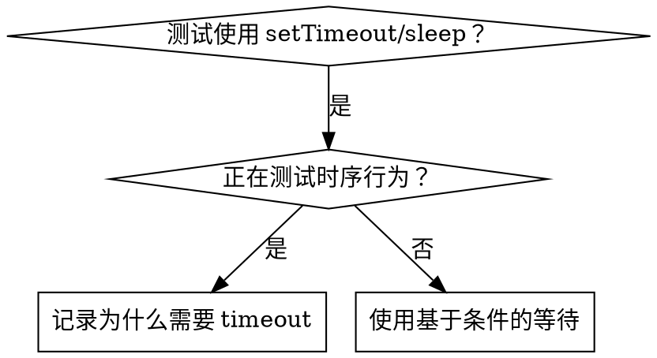

# 基于条件的等待

## 概述

不稳定测试经常用任意延迟猜测时序，导致它在快机器上通过，却在负载下或 CI 中失败。

**核心原则：** 等待真正关心的条件，不要猜它需要多久。

## 何时使用



测试存在任意延迟、不稳定、并行运行时 timeout，或需要等待异步操作完成时使用。测试真实时序行为（debounce、throttle interval）时不要使用；使用任意 timeout 时必须记录原因。

## 核心模式

```typescript
// 错误：猜测时序
await new Promise(r => setTimeout(r, 50));
const result = getResult();
expect(result).toBeDefined();

// 正确：等待条件
await waitFor(() => getResult() !== undefined);
const result = getResult();
expect(result).toBeDefined();
```

## 常用模式

| 场景 | 模式 |
|---|---|
| 等待事件 | `waitFor(() => events.find(e => e.type === 'DONE'))` |
| 等待状态 | `waitFor(() => machine.state === 'ready')` |
| 等待数量 | `waitFor(() => items.length >= 5)` |
| 等待文件 | `waitFor(() => fs.existsSync(path))` |
| 复杂条件 | `waitFor(() => obj.ready && obj.value > 10)` |

## 实现

```typescript
async function waitFor<T>(
  condition: () => T | undefined | null | false,
  description: string,
  timeoutMs = 5000
): Promise<T> {
  const startTime = Date.now();

  while (true) {
    const result = condition();
    if (result) return result;

    if (Date.now() - startTime > timeoutMs) {
      throw new Error(`Timeout waiting for ${description} after ${timeoutMs}ms`);
    }

    await new Promise(r => setTimeout(r, 10)); // 每 10ms 轮询一次
  }
}
```

完整实现和领域 helper（`waitForEvent`、`waitForEventCount`、`waitForEventMatch`）见本目录的 `condition-based-waiting-example.ts`。

## 常见错误

- **轮询过快：** `setTimeout(check, 1)` 会浪费 CPU。改为每 10ms 轮询。
- **没有 timeout：** 条件永不满足时会无限循环。必须提供 timeout 和清晰错误。
- **陈旧数据：** 不要在循环前缓存状态；应在循环内调用 getter 获取新数据。

## 何时可以使用任意 timeout

```typescript
// 工具每 100ms tick 一次，需要两个 tick 来验证部分输出
await waitForEvent(manager, 'TOOL_STARTED'); // 先等待触发条件
await new Promise(r => setTimeout(r, 200));  // 再等待已知时序行为
// 200ms = 两个 100ms interval，有明确依据
```

要求：先等待触发条件；延迟必须基于已知时序而非猜测；注释必须解释原因。

## 实际效果

一次真实调试中修复了 3 个文件的 15 个不稳定测试，通过率从 60% 提升到 100%，执行时间缩短 40%，并消除了竞态。
