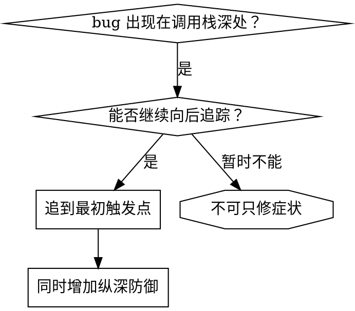

# 根因追踪

## 概述

bug 经常在调用栈深处显现，例如在错误目录执行 `git init`、在错误位置创建文件或用错误路径打开数据库。本能反应是在报错处修复，但那只是在处理症状。

**核心原则：** 沿调用链向后追踪，直到找到最初触发点，然后在源头修复。

## 何时使用



错误发生在执行深处、stack trace 很长、无效数据来源不明，或需要找出污染环境的测试/代码时使用。

## 追踪过程

1. **观察症状**：`Error: git init failed in ~/project/packages/core`
2. **找到直接原因**：`await execFileAsync('git', ['init'], { cwd: projectDir });`
3. **追问谁调用了它**：

   ```text
   WorktreeManager.createSessionWorktree(projectDir, sessionId)
     -> Session.initializeWorkspace()
     -> Session.create()
     -> test 中的 Project.create()
   ```

4. **继续向上追踪传入值**：`projectDir = ''`；空 `cwd` 被解析为 `process.cwd()`，也就是源码目录。
5. **找到最初触发点**：

   ```typescript
   const context = setupCoreTest(); // 返回 { tempDir: '' }
   Project.create('name', context.tempDir); // 在 beforeEach 前读取
   ```

## 无法手工追踪时添加 stack trace

```typescript
async function gitInit(directory: string) {
  const stack = new Error().stack;
  console.error('DEBUG git init:', {
    directory,
    cwd: process.cwd(),
    nodeEnv: process.env.NODE_ENV,
    stack,
  });
  await execFileAsync('git', ['init'], { cwd: directory });
}
```

测试中必须用 `console.error()`，因为 logger 可能被隐藏。危险操作前记录，而不是失败后才记录。

```bash
npm test 2>&1 | grep 'DEBUG git init'
```

从 stack trace 中找测试文件名和行号，并判断是否总是同一个测试或参数。

## 找出污染环境的测试

不知道哪个测试产生污染时，使用本目录的 `find-polluter.sh` 二分脚本：

```bash
./find-polluter.sh '.git' 'src/**/*.test.ts'
```

脚本逐个运行测试，在第一个污染者处停止。

## 实例：空 projectDir

追踪链：`git init` 在 `process.cwd()` 运行 <- `cwd` 为空 <- WorktreeManager 收到空 `projectDir` <- `Session.create()` 传入空字符串 <- 测试在 `beforeEach` 之前访问 `context.tempDir` <- `setupCoreTest()` 初始返回 `{ tempDir: '' }`。

根因是顶层变量初始化读取了尚未初始化的值。修复方式是把 `tempDir` 改为 getter，并在 `beforeEach` 前访问时抛错；同时在入口、业务、测试环境和 debug 日志四层增加防御。

## 原则与提示

找到直接原因后，只要还能向上一层追踪，就继续；确认源头后在源头修复，并在沿途增加校验。绝不能只修错误显现的位置。

- 测试中用 `console.error()`，不要依赖可能被隐藏的 logger。
- 在危险操作之前记录。
- 包含目录、cwd、环境变量、时间戳和完整 stack。

一次真实案例通过 5 层追踪定位根因，在源头修复并增加 4 层防御，1847 个测试全部通过且不再污染环境。
